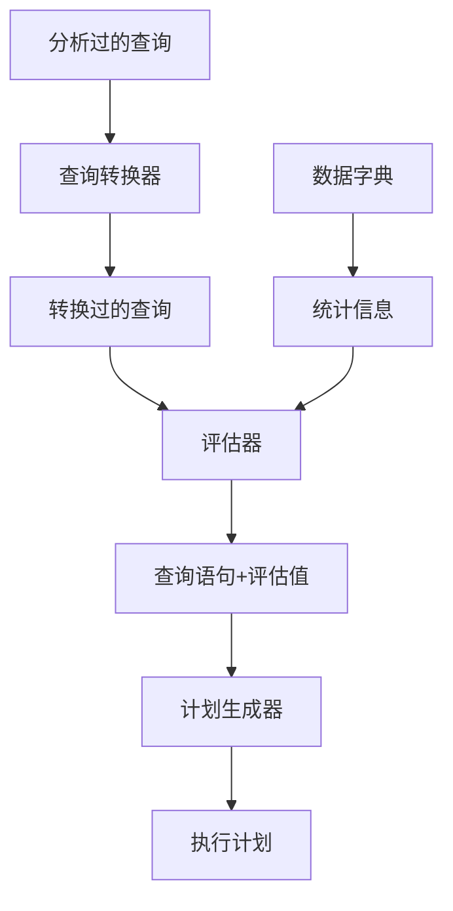

# Oracle 执行计划 学习笔记

#### 什么是执行计划
- 执行计划显示在执行一条SQL语句时必须执行的详细步骤。
- 这些步骤表示为一组数据库运算符
- 这些运算符机器实施的顺序由优化器适应查询转换及物理优化技术的组合来确定
- 执行计划通常以表格形式显示，实际上是树形结构。

### 体验执行计划
```sql
select * from dba_users;

select count(*) from dba_objects;
select count(*) from dba_tab_statistics;

drop table my_dba_objects;
create table my_dba_objects as select * from dba_objects;

--构造出大表
insert into my_dba_objects select * from my_dba_objects;
select count(*) from my_dba_objects;


drop table my_dba_tab_statistics;
create table my_dba_tab_statistics as select * from dba_tab_statistics where rownum<=100;--构造出小表
select count(*) from my_dba_tab_statistics;


--没有采集统计信息
select /*+ leading(b) use_nl(a) */count(*) from my_dba_objects a,my_dba_tab_statistics b where a.owner=b.owner and a.object_name=b.table_name;
--5.6s
select /*+ leading(a) use_nl(b) */count(*) from my_dba_objects a,my_dba_tab_statistics b where a.owner=b.owner and a.object_name=b.table_name
;
--6.9s
select /*+ leading(a) use_hash(b) */count(*) from my_dba_objects a,my_dba_tab_statistics b where a.owner=b.owner and a.object_name=b.table_name
;
--0.6s
--***最优***
select /*+ leading(b) use_hash(a) */count(*) from my_dba_objects a,my_dba_tab_statistics b where a.owner=b.owner and a.object_name=b.table_name
;
--0.09s

/*
结论：
在没有索引可用的情况下，小表作为驱动表（外表）,采用hash join最快

*/

select * from table(dbms_xplan.display_cursor('8hzkxthbd776j',0,format => 'TYPICAL IOSTATS MEMSTATS LAST'));

```

### 查看执行计划
#### 1. PLSQL中使用 F5 快捷键
#### 2. EXPLAIN PLAN 命令  -> 只是查看执行计划，实际没有执行语句
```sql
SQL> EXPLAIN PLAN FOR
  2  select * from glt_srcstano where srcstano_srcid = 'PF410440000002328400458';
 
Explained
 
SQL> 
SQL> SELECT plan_table_output
  2  FROM table(dbms_xplan.display('plan_table',null,'basic'));
 
PLAN_TABLE_OUTPUT
--------------------------------------------------------------------------------
Plan hash value: 1562101180
--------------------------------------------------------------
| Id  | Operation                          | Name            |
--------------------------------------------------------------
|   0 | SELECT STATEMENT                   |                 |
|   1 |  TABLE ACCESS BY GLOBAL INDEX ROWID| GLT_SRCSTANO    |
|   2 |   INDEX RANGE SCAN                 | PK_GLT_SRCSTANO |
--------------------------------------------------------------
 
9 rows selected
 
SQL>
```

#### 3. V$SQL_PLAN 
使用DBMS_XPLAN包来显示执行计划 -> 先执行语句，然后根据实际执行过程查看执行计划

- 先执行语句
- 通过v$sql 视图查看sql_id
- 通过dbms_xplan.display_cursor 以及sql_id 查看执行计划

```
SQL> select * from glt_srcstano where srcstano_srcid = 'PF410440000002328400458';
SRCSTANO_SRCID          SRCSTANO_STANOTY SRCSTANO_STANO SRCSTANO_SRCSTANOST SRCSTANO_CRTDT
----------------------- ---------------- -------------- ------------------- --------------
PF410440000002328400458 BT01             1              N                   20200801      

SQL> select * from v$sql where sql_text like '%srcstano_srcid%';
SQL_TEXT                                                                         SQL_FULLTEXT                                                                                                                                                            SQL_ID        SHARABLE_MEM
-------------------------------------------------------------------------------- -------------------------------------------------------------------------------- ------------- ------------ 
select * from glt_srcstano where srcstano_srcid = 'PF410440000002328400458'      select * from glt_srcstano where srcstano_srcid = 'PF410440000002328400458'      40jp3r5rmfjtp        27909    


SQL> SELECT plan_table_output FROM table(dbms_xplan.display_cursor('40jp3r5rmfjtp',null,'basic'));
 
PLAN_TABLE_OUTPUT
--------------------------------------------------------------------------------
EXPLAINED SQL STATEMENT:
------------------------
select * from glt_srcstano where srcstano_srcid =
'PF410440000002328400458'
Plan hash value: 1562101180
--------------------------------------------------------------
| Id  | Operation                          | Name            |
--------------------------------------------------------------
|   0 | SELECT STATEMENT                   |                 |
|   1 |  TABLE ACCESS BY GLOBAL INDEX ROWID| GLT_SRCSTANO    |
|   2 |   INDEX RANGE SCAN                 | PK_GLT_SRCSTANO |
--------------------------------------------------------------
 
15 rows selected
 
 
 ---第二种写法
SQL> SELECT plan_table_output FROM v$sql s, TABLE(dbms_xplan.display_cursor(s.sql_id,s.child_number,'basic')) t 
WHERE s.sql_text like '%select * from glt_srcstano where srcstano_srcid%';


```

解读执行计划顺序： 从上到下，从右到左。 树状图：后序访问

##### 优化器工作过程


### 检查执行计划

####   基数
 每个对象是否生成正确的行数？
什么是基数？
• 估算将返回的行数
• 单值谓词的基数= 行的总数/不同值的总数
• 例如：共100 行，共10 个不同值=> 基数= 10 行
• 或者，如果为柱状图表示，则是行数* 密度
为什么要关注？
• 它将影响所有方面！访问方法、联接类型、联接顺序等
哪些因素会导致基数出错？
• 统计信息陈旧/缺少
• 数据偏差
• 一个表有多个单列谓词
• where 子句谓词中包含函数
• 复杂表达式，其中包含来自不同表的列

|  原因   |  解决方法  |
|-------|:---:|
|  统计信息陈旧/缺少   |  DBMS_STATS   |
|  数据偏差  | 创建一个柱状图* |
  | 一个表有多个单列谓词使用  |  DBMS_STATS.CREATE_EXTENDED_STATS 创建一个列组
  | 在一个联接中使用多个列使用  |  DBMS_STATS.CREATE_EXTENDED_STATS 创 建一个列组
  | 包含函数的列  | 使用 DBMS_STATS.CREATE_EXTENDED_STATS 创 建有关包含函数的列的统计信息 
   |  复杂表达式，其中包含来自多个表 的列  | 使用4 级或更高的动态抽样级别


####   访问方法
 是否以最好的方式访问数据？扫描？索引查找？
 
  |   访问方法  |  解释 |
  |-------|:---:|
  |  完整表扫描  |  读取表中所有行并过滤掉那些不符合WHERE 子句谓词的行。用于索引、DOP集等
  |  按ROWID 访问表  |  ROWID 指定含有所需行的数据文件和数据块以及该行在该块中的位置。当在索引或WHERE 子句中提供rowid 时使用
  |  索引唯一扫描  |  将只返回一行。当语句中包含UNIQUE 或PRIMARY KEY 约束条件时使用，这些约束条件用于保证只访问一行
  |  索引范围扫描  |  访问相邻索引项，可返回多个ROWID 值。与等式一起用于非唯一索引，或与范围谓词一起用于唯一索引（<.>、between 等）
  |  索引跳过扫描  |  如果前导列中只有很少的不同值，而非前导列中有许多不同的值，则跳过索引的前导部分，使用其余有用的部分
  |  完整索引扫描  |  处理索引的所有叶块，但只有经过足够多的分支块才能找到第1 个叶块。当所有需要的列都位于索引中且order by 子句与索引结构匹配，或者排序合并联接已完成时，即可使用
  |  快速完整索引扫描  |  扫描索引中的所有块，用来在所有需要的列都在索引中时代替FTS。使用多块IO，可以并行运行
  |  索引联接  |  散列联接多个索引，这些索引一起包含有查询中引用的所有表列。不会消除排序操作
  |  位图索引  |  使用键值位图和映射函数，映射函数可将每个比特的位置转换成一个rowid。可以有效地合并对应于WHERE 子句中的多个条件的索引
 
 
 
 
  |   问题  |  原因
  |-------|:---:|
  |  使用表扫描，而不是索引扫描  |  DOP 针对表，而不是索引或MBRC 值
  |  采用错误的索引  |  1.统计信息陈旧/缺少   2.采用了匹配最多列的索引 3. 完整索引访问方式的开销要比索引查找后跟表访问方式的开销低
  
  
####  联接顺序
  是否以正确的顺序联接各表以便尽早尽多地消除数据？
  • 一个联接可从多个表中检索数据
• 可能的联接类型包括
嵌套循环联接
散列联接
智能化分区联接
排序合并联接
笛卡尔联接
外联接

在多表语句中对多个表进行联接的顺序
• 应该从可消除最多行数的表开始操作
• 将受可用访问方法的很大影响
一些基本规则
• 总是最先执行最多生成一行的联接
• 当使用外联接时，在谓词中，含有此外联接运算符的表必须
位于其他表之后
• 如果不能执行视图合并，在联接视图外部的表之前联接视图
内部的所有表

####  联接类型
  是否使用了正确的联接类型？
  
   |  联接类型  |  解释   
   |-------|:---:|
  |  嵌套循环联接  |  对于外部表中的每一行，Oracle 访问内部表中的所有行。当联接多个小型数据子集，并且有一个高效的方法（索引查找）来访问第二个表时，这非常有用
  |  散列联接  |  对两个表中较小的表执行扫描，使用结果行根据内存中的联接键创建散列表。然后扫描较大的表对结果行的联接列执行散列操作并用其值探测散列表以查，找匹配的行。对于较大的表和if equality 谓词，这非常有用
  |  排序合并联接  |  包括两个步骤：1. 排序联接操作：基于联接键对两个输入都进行排序。2. 合并联接操作：将排序的列表合并在一起。当两个表之间的联接条件是不相等条件时，这非常有用
  |  笛卡尔联接  |  将来自一个数据源的每一行与来自另一个数据源的每一行进行联接，生成这两个数据集的笛卡尔乘积。只有在表非常小时才适用。如果没有在查询中指定任何联接条件，则这是唯一的选择
  |  外联接  |  返回所有满足联接条件的行，并从没有(+) 的表中返回所有这样的行：在另一个表中没有满足联接条件的行
  
#### 分区修剪
  我执行过分区修剪吗？是否消除了足够多的数据？
####  并行度